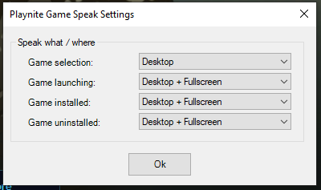

# Playnite Game Speak
   

A Text to speech plugin for playnite, it can "speak out" the game names, game launching, game installed and game uninstalled, ... texts using speech api.

[Latest Release](https://github.com/joyrider3774/PlayniteGameSpeak/releases/latest)

## Buy me a "koffie" if you feel like supporting 
I do everything in my spare time for free, if you feel something aided you and you want to support me, you can always buy me a "koffie" as we say in dutch, no obligations whatsoever...

## Settings
Using the Settings -> Plugins -> Game Speak screen you can choose which texts to speak out and where (fullscreen, desktop, both or never).
You can also specify what should be said. There is a special variable `[game]` you can put in certain events that support it, where it will be replaced by the related game's name.

## Unlock extra voice
It's possible to unlock an extra voice see here https://windowsreport.com/unlock-new-text-to-speech-voice-windows-10/

## choose text to speech voice in control panel

## Example video

## Translation
The project is translatable on [Crowdin](https://crowdin.com/project/playnite-game-speak)

#### Thanks to the following people who have contributed with translations:
Darklinpower, M0ylik, Renia, yngams, voi__Wood, Akmal Ludin, atemporal_ 
 
## Credits
* Used Icon made by [Freepik](http://www.freepik.com/)
* Original Localization file loader by [Lacro59](https://github.com/Lacro59)
